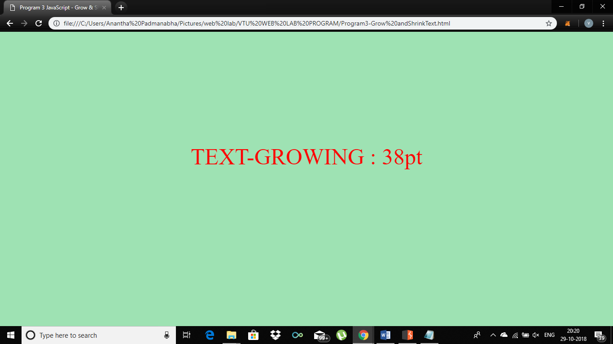
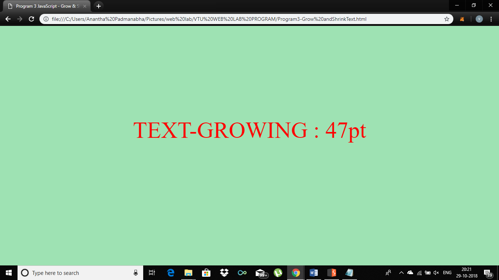
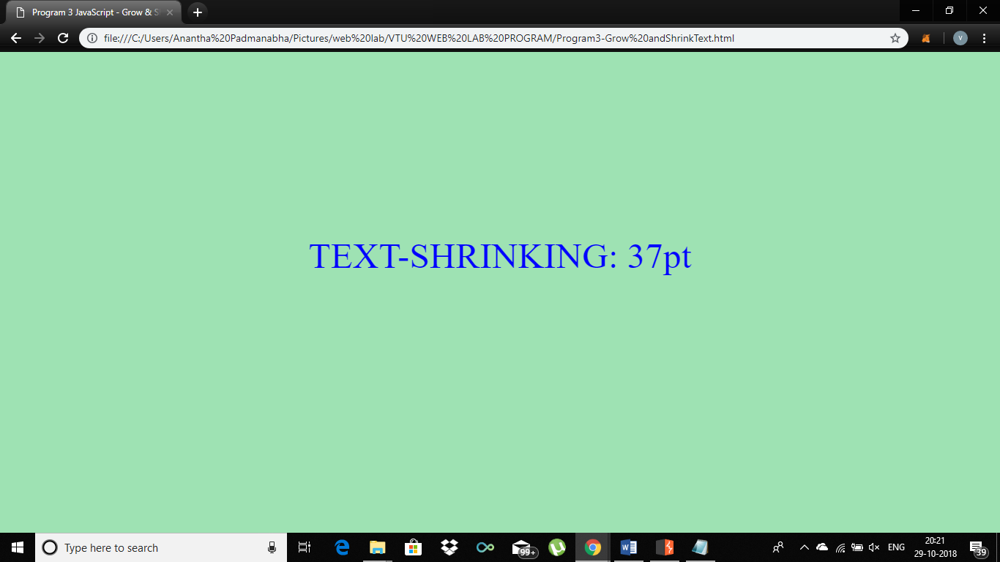
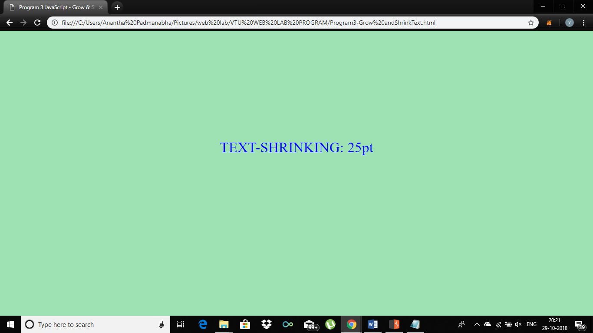
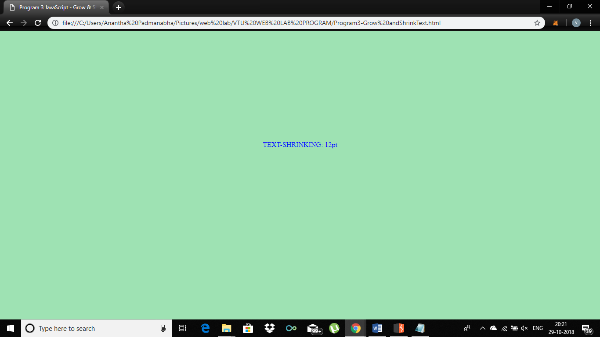

# VTU-Web-Lab-program3
Write a JavaScript code that displays text “TEXT-GROWING” with increasing font size in the interval of 100ms in RED COLOR, when the font size reaches 50pt it displays “TEXT-SHRINKING” in BLUE color. Then the font size decreases to 5pt
## Screenshot

